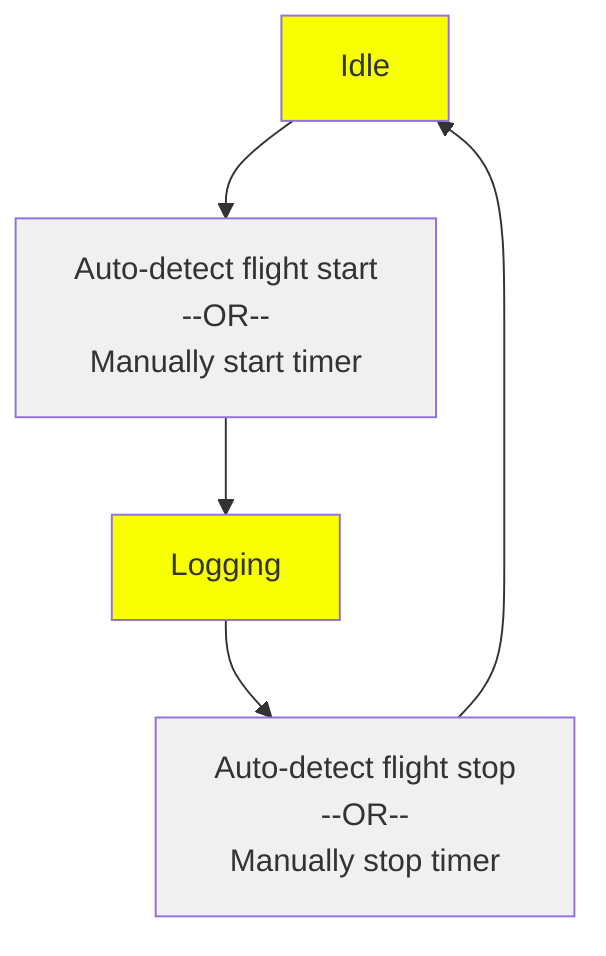

# Leaf Logging Functions

<!-- Adopted from https://docs.google.com/document/d/1Rp0IslOAHZlb1cdwXtGMdCtgvGe01PvQ_RnXXEvWxjQ/edit?usp=sharing -->

There are various terms currently used in “Leaf-Land” that have overlap or confusing definitions, such as:

> Flight, Timer, Log, Logging, LogBook, Track, TrackLog, Records, Flight Summary, etc…

This document aims to clarify the design intent, and be a helpful guide in implementing feature improvements (and code clarification) on Leaf.

## Main Operational States of Leaf

Leaf has two main operational states:
* Idle (not tracking a Flight), and
* Logging (actively tracking a Flight).

Transition between these states can be auto-detected (via motion, speed, altitude change, etc), or manually switched (by starting/stopping the flight timer).

### What Happens During Each State

The table below outlines what actions do/don't happen during each state:

<table>
  <thead>
    <tr>
      <th>Idle State</th>
      <th>Logging State</th>
    </tr>
  </thead>
  <tbody>
    <tr>
      <td><ul>
        <li>Vario Beeping is muted (if QuietMode is on)</li>
        <li>Timer is stopped at 0:00</li>
        <li>No active Flight Object</li>
        <li>No Tracking</li>
        <li>Leaf is detecting if a new Flight has started (if AutoStart is enabled)</li>
      </ul></td>
      <td><ul>
        <li>Vario Beeping is unmuted</li>
        <li>Timer is running</li>
        <li>Flight object is active</li>
        <li>Flight stats are being recorded(duration, min/max alt, etc)</li>
        <li>Logbook contains one additional LogbookEntry than before (may be a preliminary or constantly-updating Entry as the flight continues)</li>
        <li>GPSTrack file is being written (if user has enabled Tracking and GPS is available)</li>
        <li>Leaf is detecting if the current Flight has ended (if AutoStop is enabled)</li>
      </ul></td>
    </tr>
  </tbody>
</table>

## Logging Terms and Definitions

For each Logging Session (i.e., a Flight), Leaf will save a __LogbookEntry__ inside the __Logbook__.

### LogbookEntry

A LogbookEntry includes:
* Flight Summary Info
  * Flight number/index (perhaps, though maybe not visible to the user?)
  * Date, Time
  * Duration
  * Max/min values (alt, climbrate, speed, etc)
* GPSTrack File Link/Reference (if chosen to save)
  * A link to this separate GPSTrack File will be one of the fields in the LogbookEntry.  The GPSTrack File will be a separate file, in either KML or IGC format (perhaps additional formats supported in the future)

__NOTE ON GPS REQUIREMENT:__ While the GPSTrack file strictly requires a GPS fix, the LogbookEntry itself does not strictly need GPS data.  However, certain GPS information (date, time, launch location, etc) make the LogbookEntry more informative and robust.  While we anticipate usually having a GPS fix when logging, the Logbook (and each Entry) should function to a minimum level without GPS.

### Logbook

The __Logbook__ includes the collection of all __LogbookEntries__, as well as possible summations/totals of the entries, such as:
* Overall Date Range (earliest entry and latest entry)
* Total Flight Time
* Total Number of Flights
* Etc 

## Logbook User Experience

Leaf users will have a few ways of interacting with the logbook
* Viewing LogbookEntries on the Leaf display (scrolling through each previous flight in [reverse] chronological order)
  * Perhaps the option to delete an entry (typically for when it was made in error; for example accidentally starting the timer)

* Exporting the Logbook into a user-friendly format like JSON or CSV for viewing on computer in a spreadsheet, etc.

* (perhaps) Web page served by Leaf

* (perhaps) uploading a LogbookEntry over wifi to an online repository (for examples: leonardo or XCcontest)

### Current Logbook Status
Presently (8/18/2025) Leaf will only show a brief flight summary after a flight has ended (timer stopped).  Once that summary page is dismissed, it is no longer accessible.  Additionally, a GPSTrack file can be saved.  

There are no other logbook functions currently supported.  The following content is an attempt to sketch out what such additional features could look like.

### Logbook Menu
The "Log/Timer" Menu should likely be changed to "Logging" or similar.  This can incorporate both Logbook settings as well as accessing the Logbook of previously-logged flights.

The revised Logbook menu might look like this:

<pre>
___/LOGGING\______
--Settings--------
Auto Start    ☐
Auto Stop     ☐
Save GPSTrack ☐
Format     IGC/KML
------------------
Previous Flights➡
Export Logbook  ➡
------------------
Back            ⏎
</pre>

The __Settings__ would work as they do currently.

__"Previous Flights"__ (or perhaps "View Logbook") would take you into a minimalistic viewer on the Leaf display, where you would essentially see the "Flight Summary" page of the most recently logged flight (including date, time, etc so you could tell which flight that was).  Scrolling left/right would take you between logged flights.  
* Possibly, the first thing you see when selecting "previous flights" might be an overall logbook summary, with total flights, total flight time, etc etc. 

__"Export Logbook"__ would take the JSON logbook stored inside Leaf (or more likely on the SD card) and export a CSV file that would be easily human-readable & editable in a spreadsheet application.

### Flight Summary Page

The (while-viewing-logbook) Flight Summary Page might look something like this.  Perhaps there's an "erase flight" option to clean up the logbook (in case you accidentally started the timer and/or saved a really short non-flight flight) 

<pre>
____/LOGBOOK\_____
Flight      X of Y 
11:45am Mo/Dy/Year
Duration:  01h:55m
MaxAlt:     5,590'
AboveLaunch:1,590'
MaxClimb: 1,230fpm
------------------
Erase Flight    ➡
------------------
⇦Prev|Back⏎|Next⇨
</pre>

