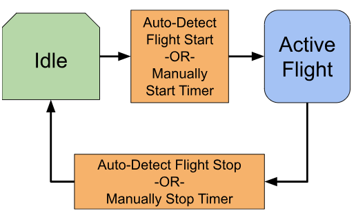
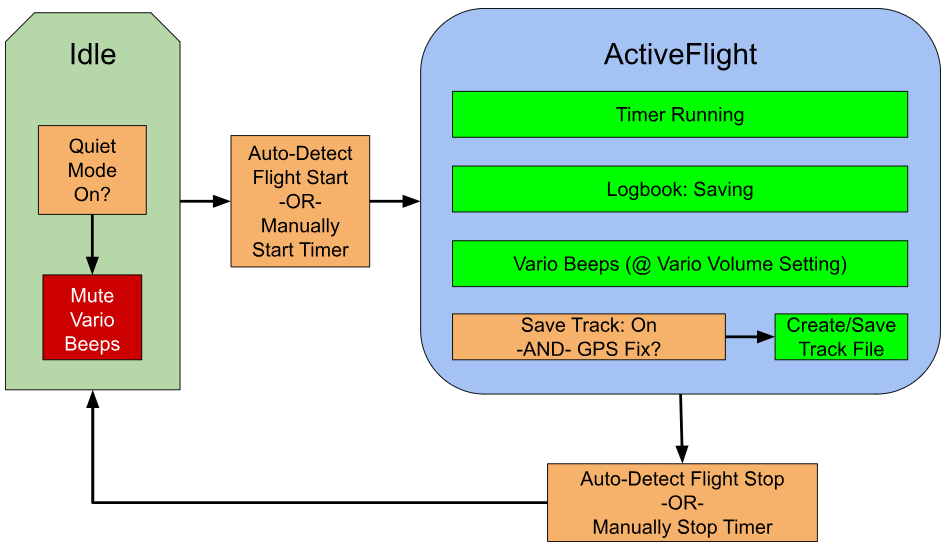

# Leaf Logging Functions

<!-- Adopted from https://docs.google.com/document/d/1Rp0IslOAHZlb1cdwXtGMdCtgvGe01PvQ_RnXXEvWxjQ/edit?usp=sharing -->

There are various terms currently used in “Leaf-Land” that have overlap or confusing definitions, such as:

> Flight, Timer, Log, Logging, LogBook, Track, TrackLog, Records, Flight Summary, etc…

This document aims to clarify the design intent, and be a helpful guide in implementing feature improvements (and code clarification) on Leaf.

## States we care about: Idle and ActiveFlight

The two main states of Leaf operation: Idle (not tracking a Flight) and ActiveFlight (actively tracking a Flight).

(Note: Leaf may be first turned on while in the air; or may be left in ActiveFlight mode after landing. These states describe what Leaf is doing (whether it considers a flight to be active), not what the pilot is actually doing).

Transition between these states can be auto-detected (via motion, speed, altitude change, etc), or manually switched.

The timer is always running when in ActiveFlight state, because it is assumed pilots will want to record the time of each flight, and seeing the timer running is an intuitive way to infer the flight has started.

## What Happens During ActiveFlight

When tracking a Flight, several things can or do happen:

- The Vario behaves like a flight instrument (beeping as appropriate, if QuietMode was turned on)
- Logbook is accruing flight time and maintaining other information about the flight, like various minimums and maximums
- GPS Track is being saved (if the SaveTrack setting is enabled and a GPS fix is present)

## Disambiguating Log, Logbook, Track…

Below we will try to refine the purpose and specifics of various flight recordings:

<table>
  <thead>
    <tr>
      <td></td>
      <th>Logbook</th>
      <th>GPSTrack</th>
    </tr>
  </thead>
  <tbody>
    <tr>
      <td>Primary Purpose:</td>
      <td>Record Flight Count &amp; Flight Time (duration) for pilot hours/experience, equipment UV exposure, etc.</td>
      <td>3D GPS track file, for use in viewing on map, replay, or uploading to XC competition sites etc.</td>
    </tr>
    <tr>
      <td>Additional Purposes:</td>
      <td>Fun records/stats of the flight, like max climb rate &amp; altitude, distance flown, etc. Save record of the flight even if GPS is turned off (user setting to save battery)</td>
      <td></td>
    </tr>
    <tr>
      <td>Formats:</td>
      <td>Text, csv, JSON</td>
      <td>KML, IGC</td>
    </tr>
    <tr>
      <td>Notes:</td>
      <td>Mostly does not require GPS</td>
      <td>Only uses GPS (fix required)</td>
    </tr>
    <tr>
      <td>Challenges</td>
      <td><ul>
        <li>Baro altitude is not absolute (depending on baro pressure setting, altitude is likely somewhat inaccurate)</li>
        <li>GPS-needed for some kinds of information, but Logbook still needs to work as well as possible when GPS is not available
          <ul>
            <li>Most helpful log entry formats (including date/time) require GPS fix</li>
            <li>Some flight stats (speed, distance) require GPS fix</li>
            <li>If flight timer is started manually, some stats data (for example max g-force) may actually occur before the pilot launches (ex: vario hitting the ground or swinging hard into the pilot/harness) which might be undesirable (pilot might want to exclude bumps on the ground from G load even though the active flight started just before takeoff)</li>
          </ul>
        </li>
      </ul></td>
      <td></td>
    </tr>
  </tbody>
</table>

When the flight timer is running and the Leaf is in the “ActiveFlight” state, we always want to “log” the flight in the Logbook (ie, ensure the Logbook contains an entry for the currently-active flight). We currently don’t envision a case where the Leaf should be in “ActiveFlight” state but the timer is NOT running nor is the flight being logged.

Separately, we may (or may not) wish to save a GPSTrack of the flight.

For an abundance of clarity, the following table describes concurrent actions/assets for each Leaf state:

<table>
  <thead>
    <tr>
      <th>Idle State</th>
      <th>ActiveFlight State</th>
    </tr>
  </thead>
  <tbody>
    <tr>
      <td><ul>
        <li>Vario Beeping is muted (if QuietMode is on)</li>
        <li>Timer is stopped at 0:00</li>
        <li>No active Flight Object</li>
        <li>No Tracking</li>
        <li>Leaf is detecting if a new Flight has started (if AutoStart is enabled)</li>
      </ul></td>
      <td><ul>
        <li>Vario Beeping is unmuted</li>
        <li>Timer is running</li>
        <li>Flight object is active</li>
        <li>Flight stats are being recorded(duration, min/max alt, etc)</li>
        <li>Logbook contains one additional LogbookEntry than before (may be a preliminary or constantly-updating Entry as the flight continues)</li>
        <li>GPSTrack file is being written (if user has enabled Tracking and GPS is available)</li>
        <li>Leaf is detecting if the current Flight has ended (if AutoStop is enabled)</li>
      </ul></td>
    </tr>
  </tbody>
</table>

A few specific terms warrant some careful consideration for use:

### Record

<table>
  <tr>
    <td>Record (noun)</td><td>Record (verb)</td>
  </tr>
  <tr>
    <td></td>
    <td></td>
  </tr>
</table>

We might think of the noun as a logbook entry, or a “max altitude record\!” achievement. Whereas the verb might be “recording your flight” in the sense of GPS tracking.

### TrackLog

While this is a fairly common term in general, and unambiguously meant GPS flight track, the use of ‘Log’ withing the term might be easily confused with a logbook entry or similar (ex:TrackLogs **don’t** reside in the logbook). So for Leaf development, this term is being replaced by GPSTrack.

## Conclusion

We have adjusted our terms slightly to avoid confusion.

### Flight

A contiguous period of time when the leaf is/was in the ActiveFlight state. During this period, the flight timer should be running, min/max records should be updating, etc. A single Flight should produce a single LogbookEntry in the Logbook.

### LogbookEntry

A logged summary of a single Flight, including duration, and min/max records, etc, in a format compliant with how we want the Logbook to be/work.

### Logbook

The collection of LogbookEntries for flights measured by leaf.

### GPSTrack

The sequence of GPS positions of the flight path, usually captured in a single file per Flight (instead of “TrackLog” which confusingly uses ‘log’).

GPSTrack files won’t reside in the Logbook; however, a LogbookEntry may contain a link to the specific GPSTrack file for a particular Flight.
