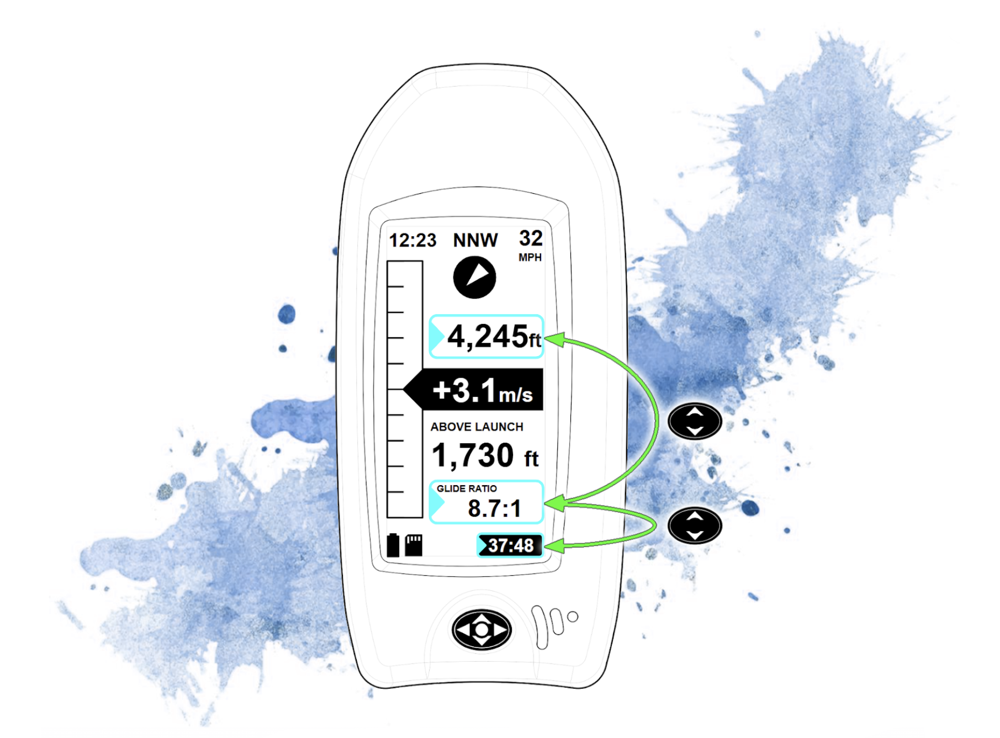

import "./style.css"
import leafLogotype from "./leaf-logotype.png"
import leafGreenBg from "./leaf-green-bg.png"
import button from "./button.png"
import buttonCenter from "./button-center.png"
import buttonLeftRight from "./button-left-right.png"
import buttonUpDown from "./button-up-down.png"
import cursorBox from "./cursor-box.png"
import leafPages from "./leaf-pages.png"
import navPage from "./nav-page.png"
import thermalPage from "./thermal-page.png"
import wifiSetup from "./wifi-setup.png"
import mainMenu from "./menu_images/MainMenu.png"
import menuAltimeter from "./menu_images/MenuAltimeter.png"
import menuVario from "./menu_images/MenuVario.png"
import menuDisplay from "./menu_images/MenuDisplay.png"
import menuUnits from "./menu_images/MenuUnits.png"
import gpsMenu from "./menu_images/GPSmenu.png"
import menuLogTimer from "./menu_images/MenuLogTimer.png"
import menuSystem from "./menu_images/MenuSystem.png"
import menuSystemAbout from "./menu_images/MenuSystemAbout.png"
import ResetButton from "./ResetButton.png"

  

  

1. [Quick Start Guide](#quick-start-guide)
2. [Menu Options](#menu-options)
3. [SD card, TrackLogs, and Waypoints](#sd-card-tracklogs-and-waypoints)
4. [Firmware Updates](#wifi-firmware-updates)
5. [Reset and Troubleshooting](#reset-and-troubleshooting)

# Quick Start Guide

### Getting Around

Meet the Directional Pad:

<table className="button-table">
  <thead>
    <tr>
      <th></th>
      <th></th>
    </tr>
  </thead>
  <tbody>
    <tr>
      <td></td>
      <td>You control the Leaf with this 5-way switch by pressing  UP, DOWN, LEFT, RIGHT, and CENTER</td>
    </tr>
    <tr>
      <td></td>
      <td>Turn Leaf ON and OFF by holding CENTER</td>
    </tr>
    <tr>
      <td></td>
      <td>Use LEFT and RIGHT to scroll through the pages</td>
    </tr>
  </tbody>
</table>

All the way to the right you’ll find the MENU page:

  

<table className="button-table">
  <thead>
    <tr>
      <th></th>
      <th></th>
    </tr>
  </thead>
  <tbody>
    <tr>
      <td></td>
      <td>Within a page, use UP and DOWN to scroll through the options</td>
    </tr>
    <tr>
      <td></td>
      <td>A cursor selection box will highlight adjustable fields</td>
    </tr>
    <tr>
      <td></td>
      <td>When selected, press CENTER to select or adjust that option</td>
    </tr>
    <tr>
      <td>For Example, Press CENTER to:</td>
      <td>
        <ul>
          <li>Start the timer (<strong>HOLD</strong> CENTER to stop)</li>
          <li>Cycle through display options in the Altitude or User fields</li>
        </ul>
      </td>
    </tr>
  </tbody>
</table>

<table className="button-table">
  <thead>
    <tr>
      <th></th>
      <th></th>
    </tr>
  </thead>
  <tbody>
    <tr>
      <td></td>
      <td>In a few cases, you can use LEFT and RIGHT on an option as well</td>
    </tr>
    <tr>
      <td>For Examples, Press L/R to:</td>
      <td>
        <ul>
          <li>Adjust the barometric altimeter</li>
          <li>Scroll through waypoints and routes on the NAV page</li>
        </ul>
      </td>
    </tr>
  </tbody>
</table>

> **Shortcut:** When MSL Altitude is selected, hold CENTER to sync the baro altitude to the GPS altitude. This is useful if you don’t know the site altitude or current pressure setting.

### User Page
The  main operational page for standard vario information

  

*Blue are fields that can be adjusted; Green is fixed information*
### Nav Page
The Nav Page is used when tracking to GPS waypoints or routes

  

*Blue are fields that can be adjusted; Green is fixed information*
# Menu Options

### Main Menu

  

Use the main menu to adjust settings for the following submenus:

### Altimeter Menu

  

- **GPS Altitude**: Displays current GPS altitude, if a GPS fix is available
- **Sync Now**: Immediately adjusts the barometric pressure setting to align pressure altitude with GPS altitude
- **@LogStart**: Automatically performs the above mentioned sync when a flight timer/log is first started
- **Std Barometric Altitude**: Displays the current altitude based on the standard barometric pressure of 1013.25 hPa (29.921 inHg)
- **Adj Barometric Altitude**: Displays the adjusted altitude based on the current altimeter setting
- **Set**: Displays the current altimeter setting in inHg
- **Adjust Altitude**: highlight and press (or hold) left or right to adjust the altimeter setting and pressure altitude

### Vario Menu

  

- **Beep Vol**: The volume setting for vario climb/sink beeping.  Choose OFF-LOW-MED-HIGH
- **QuietMode**: Mutes vario beeps until flight log/timer is started
- **Sensitivity**: How reactive the vario is.  1 (low) is approximately 1 second of averaging, 5 (high) is approximately 0.05 seconds.  3 is default and works well.
- **ClimbStart**: How many fpm (or m/s) of climb is required to start beeping.  Lower values catch lift early, but may beep more than desired especially when just barely maintaining altitude.
- **SinkAlarm**: The descent rate required before the sink alarm starts beeping.  Values closer to zero will result in an often-beeping sink alarm.  Typically between -400 and -600 fpm (-2 and -3 m/s) is a good starting point for most pilots.

### Display Menu

  

- **Show Pages**: turn each page on or off.  If all pages are turned off, the last-used page will still be available.  Note: when exiting the menu, the previous page (shown just before entering the menu) will be shown.  If this page was turned off, just scroll left further to another page, then it will no longer be shown.
- **Basic**: The basic thermal page with less info and larger fonts
- **User**: Thermal page with 2 user fields (scroll up on these pages to highlight the fields, then press CENTER to change the information shown)
- **Navigate**: GPS waypoint following page.  
- **Contrast**: Adjust contrast between level 1 and 20.  Typically around 7 is a good starting point.

### Units Menu

  

Scroll through each field and set your desired units for the display

- **Altitude**: feet, or meters
- **ClimbRate**: feet per minute, or meters per second
- **Speed**: mph, or kph
- **Distance**: miles, or kilometers (will switch to feet or meters for shorter distances)
- **Heading**: Degrees (from North)or compass directions (NNW etc)
- **Temp**: F or C
- **Time**: 12 hr or 24 hr

### GPS Menu

  

- **Icon in top right**: shows searching for fix (and how many satellites are in view), or a solid dot in the crosshairs when a fix is obtained
- **Sats**: How many satellites are in the calculated fix solution (will be zero until a fix is obtained)
- **HDOP**: Horizontal dilution of precision.  Lower values are better, and indicate a more accurate fix.  Typically below 2 is good, below 1 is excellent.
- **Satellite Sky View**: Shows satellites seen by Leaf.  Outer circle is horizon, center is directly overhead.  North is up.  Dark satellites are higher Signal-to-Noise than Light satellites.
- **Latitude**: Degrees (decimal) up from the equator (negative is south)
- **Longitude**: Degrees (decimal) east of the prime meridian (negative is west)
- **Update Seconds**: How often the GPS is updated (this is not currently changable, but may allow reducing update frequence to save battery in future software updates)

### Log/Timer Menu

  

- **Format**: IGC (for online logs like XContest) or KML (Google Earth)
- **SaveLog**: Save a log file when timer is running (and GPS has a fix)
- **AutoStart**: Start a log automatically if moving over 8 mph for several seconds
- **AutoStop**: Stop a running log if no motion or altitude change is detected for approximately 20 seconds.  An alert will sound 10 seconds before stopping so you can press a button (or just shake Leaf) to keep the log running.

### System Menu

  

- **TimeZone**: Set your local timezone with LEFT/RIGHT.  If you press CENTER, you can switch to adjusting by 0:15 minute increments (a few countries don't have even-hour timezones). Press CENTER again to switch back to hour increments.
- **Volume**: Volume for system-level alerts, button presses, and notifications (not vario beeps).  Choose between OFF, LOW, MEDIUM, HIGH.  Note: the vario beeps volume is set in the Vario Menu.
- **Auto-Off**: Automatically turn Leaf off if no log is running, and if no button has been pressed for a certain amount of time.  Typically 5 or 10min is a good value to use.
- **ShowSafety**: Show the safety disclaimer on start up.  If you've accepted this once, you can turn it off here to not see it every time.
- **Wifi**: Use WiFi for updating firmware (see firmware update section further below)
- **Bluetooth**: Turn Bluetooth on for sharing Leaf data with certain smartphone apps.  You don't need to do anything on Leaf to pair, just turn on bluetooth, then select the Leaf device in the compatible phone app.
- **About**: See information about your Leaf, including the current firmware version, IP address (if currently connected to WiFi), MAC address, and FCC ID.

  

- **Reset**: Hold the center button to reset all Leaf settings.  This will not erase your SD card or logs.

# SD Card, TrackLogs, and Waypoints

### Accessing the SD card

Leaf functions as a mass-storage device.  Simply plug it in to any computer or smartphone and you should see a "LEAF VARIO" drive appear with the SD card contents.  
*Note: a second drive may also appear with the firmware files.  This can be ignored as it is only used for the rare occassion when you may wish to manually update the firmware.*

### Saving Track Logs

Flight logs will save to SD Card. Be sure to turn on the “Save Log” setting inside the Log Menu.

Logs can be saved in either KML or IGC format.

### Loading Waypoints and Routes

When Leaf is first turned on, it will look for a file named “waypoints.gpx” in the root directory of the SD card.

Create a file with this name and save it to the SD Card, then restart Leaf (unplug Leaf from your computer first to fully shut down).  Then access your waypoints and routes on the Nav Page by scrolling up to the waypoint item.

We expect to be adding additional software features for saving and creating flight routes.  We understand the waypoints.gpx file is a bit primative at this stage.

# WiFi Firmware Updates

Leaf can update to the latest firmware over WiFi. To configure the Leaf WiFi Settings, you’ll need another device (phone or computer).

Here’s the process:

1.  Enter the Manual WiFi Setup Mode on Leaf:

    Main Menu➡System➡WiFi➡Setup

2.  Switch to your other device, then find and join the “Leaf” WiFi Network. This should bring up a WiFi Manager page.  If it doesn't come up automatically, you may first need to click “Sign in to Leaf WiFi” on your device, or visit http://192.168.4.1).

    ➡Click “Configure Wifi”

3.  Select your WiFi Network from the list (or type it in), and enter the password. Remember the SSID and password fields are Case Sensitive.

    ➡Click “Save”

    Leaf will then attempt to connect to your WiFi Network. If successful, Leaf will automatically exit the "Setup" page, and show connection status.

4.  Now click “Update FW” on Leaf to automatically check for and download the latest firmware. Leaf will restart when finished checking and/or updating.

  

### NOTE: For Updates In-The-Field

If WiFi is not available and you would like to use your cellular internet connection to update Leaf, follow these steps:

1.  Turn on and configure your WiFi Hotspot feature on your phone/device. Be sure to remember the SSID Name and Password.
2.  Follow steps #1-3 above to connect to the Leaf Network and enter your Hotspot information into the Leaf WiFi Manager. Note that connecting to the Leaf Network on your device will likely automatically turn off your Hotspot feature. This is ok.
3.  Immediately after clicking “save” in Step #3, again turn on your device’s Hotspot Feature.
4.  Leaf will try to connect to the Hotspot network. If successful, update Leaf firmware as described in step #4 above.
5.  Once Leaf has updated and restarted, you can turn off your Hotspot feature.

# Reset and Troubleshooting

### Restore Factory Defaults
To return all settings to the factory configuration, go to the System Menu, then scroll down to the Reset option. Hold the center button to reset all Leaf settings. This will not erase your SD card or logs.

### Hard Reset Leaf
Performing a hard reset is useful if Leaf becomes frozen or unresponsive.  The reset button is hidden behind the speaker grille.  Press a paperclip or pin into the lower-end of the largest speaker slot to hard reset Leaf.  This will force a reboot, but it won't reset your user settings or touch your SD card.  After you reset Leaf, you will need to turn it on again if it wasn't plugged into a USB cable at the time.

  

### Reloading Firmware Manually

**WARNING** *Manually loading firmware is only for advanced users.  For general updates, please use the [WiFi update process](#wifi-update-process) described above.*

**If you are manually loading firmware, you MUST be sure to use the correct firmware version for your specific Leaf hardware version.  For most users, this will be 3.2.7_release.  If you are unsure, please contact us before proceeding.**

There are two methods for manually loading firmware:
##### Flash firmware via USB drive
When plugging Leaf into a computer, you will see two removable drives appear.  One is the SD card, labeled "LEAF VARIO", where you'll find tracklogs and store waypoint files.  The other drive is the processor boot partition, which can be used to update firmware.  Simply drag and drop the new firmware file onto this drive.  Leaf will reboot to the new firmware once the file is transferred and loaded.  **DO NOT UNPLUG** Leaf until the process is complete.

##### Flash firmware via USB cable and programming tools

For advanced users who wish to reprogram the firmware manually, the "Boot" button is located behind the smallest speaker hole.  To enter bootloader mode, press and hold this button while plugging in the USB cable, then release the Boot button.  Or, while already plugged into USB, press and hold the "Boot" button then press and release the "Reset" button, then release the "Boot" button.  Once in bootloader mode, the firmware can be uploaded using Arduino, PlatformIO, or Espressif tools.