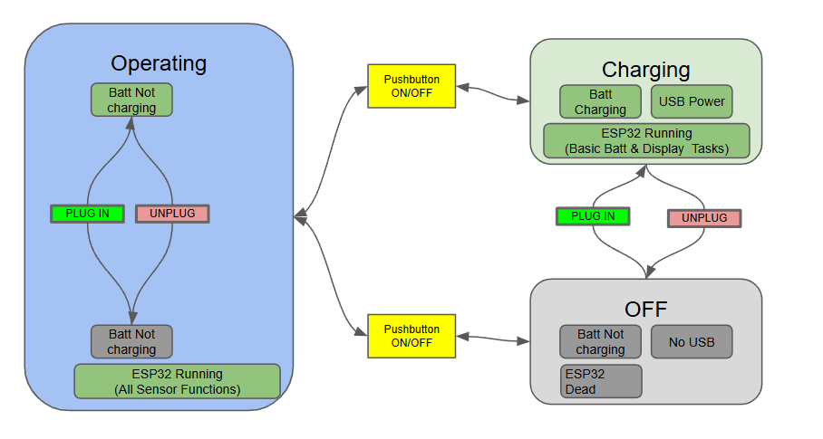

## Required libraries

See list of required libraries in the `libraries` section of the [Arduino workflow](../../.github/workflows/arduino.yaml).

## ESP32 configuration

ESP Board Manager Package 3.0.2

- USB CDC On Boot -> "Enabled"
- Flash Size -> 8MB
- Partition Scheme -> 8M with spiffs (3MB APP/1.5MB SPIFFS)

Arduino board: ESP32S3 Dev Module

(see [Arduino workflow](../../.github/workflows/arduino.yaml) to confirm specifics)

## Programming with PlatformIO

See [leaf README](../README.md)

## Programming with Arduino

To program the current hardware:

- Install Arduino IDE and [ESP Board Manager Package](#esp32-configuration)
- Install [required libraries](#required-libraries)
- Plug board into USB
- Select the [appropriate board](#esp32-configuration) and port in the Arduino IDE
- Configure the [appropriate board settings](#esp32-configuration)

## Fatal errors

When something happens that shouldn't ever happen, the function `fatalError` in [diagnostics/fatal_error.h](./diagnostics/fatal_error.h) should be called. When it is called, it will attempt to capture as much information as practical about the failure and print that information to the Serial log, SD card, and screen, when possible.

### Decoding backtraces

One thing `fatalError` does is print a backtrace (stack trace) of the current execution point. A backtrace looks like:

```
Backtrace: 0x420189EF:0x3FCC0770 0x4201904A:0x3FCC0790 0x42016152:0x3FCC07E0 0x4206D96F:0x3FCC0800 0x40384AAE:0x3FCC0820
```

There are a number of ways to decode this into a human-readable stack trace, but the recommended method is:

- Ensure the current PlatformIO environment, git version, and codebase state exactly match the firmware from which the backtrace was obtained
- Open command palette (ctrl-shift-P in Windows)
- Select "Tasks: Run Task" (may have to type some of that in to find the appropriate entry)
- Select "Decode ESP32 Backtrace" (may have to scroll to find it)

If the backtrace is already copied to the clipboard, the decoded content will be displayed immediately. Otherwise, the terminal will prompt you to paste in the backtrace of interest.

Note: the Linux/Mac script for decoding backtraces is untested -- feedback welcome!

## Notes

tried but not going to use:

- NeoGPS: 4.2.9
  -> change GPSport.h to define HWSerial:
  #define gpsPort Serial0
  #define GPS_PORT_NAME "Serial0"
  #define DEBUG_PORT Serial
  -> enable PARSE_GSV string and PARSE_SATELLITES and PARSE_SATELLITE_INFO
  -> enable NMEAGPS_INTERRUPT_PROCESSING
- ICM20948_WE
- AdaFruit ICM20948 (and associated dependencies)

## System state diagrams

System behavior is governed by the state of the system:



This is managed by [`Power`](./power.h) in the following way:

```mermaid
flowchart TD
  Off["Off<br>(off and unplugged)"]
  Charging["Charging [OnUSB]<br>(charging screen)"]
  Operating["Operating [On]"]
  class Off,Charging,Operating State

  bootUp["<code>bootUp()</code>"]
  switchToOnState["<code>switchToOnState()</code>"]
  shutdown["<code>shutdown()</code>"]
  class bootUp,switchToOnState,shutdown Transition

  Off -->|"Plug in"| bootUp -->|"<i>If plugged</i>"| Charging
  Off -->|"Hold power button"| bootUp -->|"<i>If unplugged</i>"| switchToOnState
  Charging -->|"Hold power button"| switchToOnState --> Operating
  Charging -->|"Unplug or<br>hard reset"| Off
  Operating -->|"Hold power button"| shutdown -->|"<i>If plugged</i>"| Charging
  shutdown -->|"<i>If unplugged</i>"| Off
  Operating -->|"Hard reset"| Off

  classDef State fill:#f7ff00
  classDef Transition fill:#f0f0f0
```

## Information flow diagram

```mermaid
flowchart LR
    subgraph Physical HW components
        MS5611dev>MS5611]
        AHT20dev>AHT20]
        ICM20948dev>ICM20948]
        GPSdev>GPS]
        Keypad>Keypad]
    end

    subgraph Hardware abstraction
        AHT20hw["AHT20"]
        MS5611["MS5611"]
        subgraph ICM20948["ICM20948"]
            ICM_20948_I2C
        end
        LC86G
        Buttons
    end

    subgraph Mocks
        UDPMessageServer["UDP message server"]
    end

    subgraph Instruments
        Ambient["Ambient<br>(<code>ambient</code> singleton)"]
        Barometer["Barometer<br>(<code>barometer</code> singleton)"]
        IMU["IMU<br>(<code>imu</code> singleton)"]
        subgraph LeafGPS["LeafGPS (<code>gps</code> singleton)"]
            TinyGPSPlus
        end
    end

    subgraph Loggers
        MessageLogger["Message logger"]
    end

    subgraph MessageBus["Message bus"]
        PressureUpdateMessage["<code>PressureUpdate</code><br>message"]
        AmbientUpdateMessage["<code>AmbientUpdate</code><br>message"]
        MotionUpdateMessage["<code>MotionUpdate</code><br>message"]
        GpsMessage["<code>GpsMessage</code><br>message"]
        ButtonEvent["<code>ButtonEvent</code><br>message"]
    end

    subgraph VarioLogic
    end

    MS5611dev <-->|Wire| MS5611 --> PressureUpdateMessage --> Barometer
    AHT20dev <-->|Wire| AHT20hw --> AmbientUpdateMessage --> Ambient
    GPSdev <-->|Serial0| LC86G --> GpsMessage --> LeafGPS
    Keypad -->|GPIO| Buttons --> ButtonEvent --> ButtonDispatcher
    ButtonEvent --> ButtonMonitor

    UDPMessageServer -.-> MessageBus -.-> MessageLogger

    ICM20948dev <-->|TwoWire| ICM_20948_I2C["ICM_20948_I2C<br>(Sparkfun lib)"]
    ICM20948 --> MotionUpdateMessage --> IMU

    Barometer --> VarioLogic
    IMU --> VarioLogic
    Ambient --> VarioLogic
    LeafGPS <--> VarioLogic
```
