# Buttons hardware

## Overview

Leaf has a 5-way switch where only one switch may be pressed at a time. The state transition diagram for these buttons is shown below. Yellow events are dispatched to the message bus as messages.

Generally, consumers should use either Held + HeldLong events, or they should use Increment events. It should be unusual to use both Increment events and either Held or HeldLong.

## State transition diagram

```mermaid
flowchart LR
    UpState["Up"]
    DebouncingState["Debouncing"]
    DownState["Down"]
    HeldState["Held"]
    HeldLongState["HeldLong"]
    class UpState,DebouncingState,DownState,HeldState,HeldLongState State

    PressedEvent["Pressed<br>event"]@{ shape: card }
    HeldEvent["Held<br>event"]@{ shape: card }
    HeldLongEvent["HeldLong<br>event"]@{ shape: card }
    ClickedEvent["Clicked<br>event"]@{ shape: card }
    ClickedEventNewButton["Clicked<br>event"]@{ shape: card }
    IncrementEventDown["Increment<br>event"]@{ shape: card }
    IncrementEventHeld["Increment<br>event"]@{ shape: card }
    IncrementEventHeldLong["Increment<br>event"]@{ shape: card }
    ReleasedEventUp["Released<br>event"]@{ shape: card }
    ReleasedEventDown["Released<br>event"]@{ shape: card }
    class PressedEvent,HeldEvent,HeldLongEvent,ClickedEvent,ClickedEventNewButton,IncrementEventDown,IncrementEventHeld,IncrementEventHeldLong,ReleasedEventUp,ReleasedEventDown Event

    ResetDebounceTimer["Reset debounce timer,<br>set current button"]@{ shape: delay }
    IncrementHoldCounterHeld["Increment hold counter,<br>reset increment timer"]@{ shape: delay }
    IncrementHoldCounterHeldLong["Increment hold counter,<br>reset increment timer"]@{ shape: delay }
    class ResetDebounceTimer,IncrementHoldCounterHeld,IncrementHoldCounterHeldLong Operation

    ReleasedEventUp --> UpState
    ReleasedEventDown --> ResetDebounceTimer
    UpState -->|"button pressed"| ResetDebounceTimer --> DebouncingState
    DebouncingState -->|"1: no button pressed"| UpState
    DebouncingState -->|"2: different button<br>pressed"| ResetDebounceTimer
    DebouncingState -->|"3: debounce time<br>elapsed"| PressedEvent --> DownState
    DownState -->|"1: no button pressed"| ClickedEvent --> ReleasedEventUp
    DownState -->|"2: different button<br>pressed"| ClickedEventNewButton --> ReleasedEventDown
    DownState -->|"3: hold time elapsed"| HeldEvent --> IncrementEventDown --> HeldState
    HeldState -->|"1: no button pressed"| ReleasedEventUp
    HeldState -->|"2: different button<br>pressed"| ReleasedEventDown
    HeldState -->|"3: increment<br>time elapsed"| IncrementHoldCounterHeld --> IncrementEventHeld --> HeldState
    HeldState -->|"4: hold long<br>time elapsed"| HeldLongEvent --> HeldLongState
    HeldLongState -->|"1: no button pressed"| ReleasedEventUp
    HeldLongState -->|"2: different button<br>pressed"| ReleasedEventDown
    HeldLongState -->|"3: increment<br>time elapsed"| IncrementHoldCounterHeldLong --> IncrementEventHeldLong --> HeldLongState

    classDef State fill:#90EE90
    classDef Event fill:#EEEE90
    classDef Operation fill:#9090EE
```

